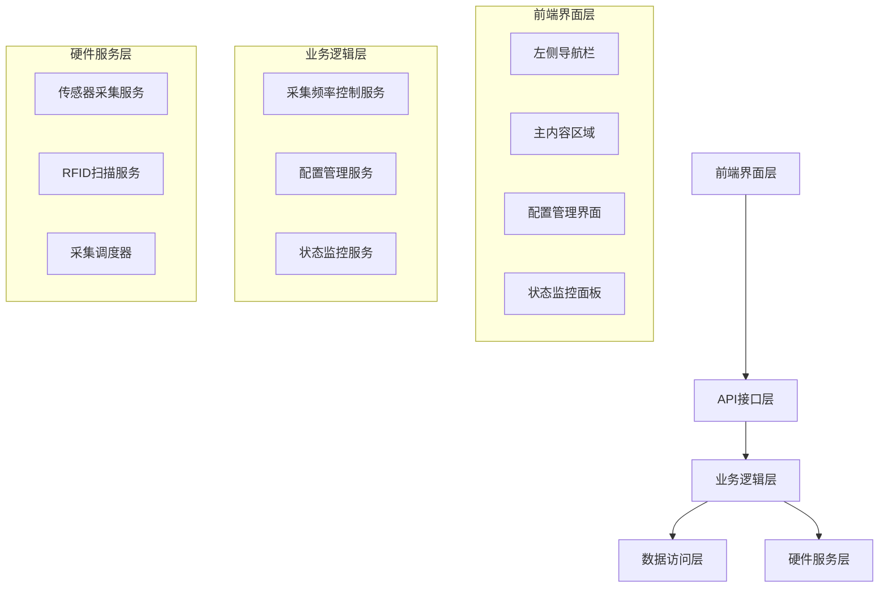

# 设计文档

## 概述

界面优化与数据采集控制功能的设计基于现有的档案库房智能监测系统架构，主要包含前端界面布局重构和后端数据采集频率控制两个核心模块。设计采用渐进式改进的方式，确保在不影响现有功能的前提下实现界面优化和性能控制。

## 架构

### 整体架构图



### 核心组件关系

前端界面层通过 API 接口与后端服务通信，业务逻辑层负责处理采集频率控制和配置管理，硬件服务层实现具体的数据采集功能。

## 组件和接口

### 前端组件

#### 1. 左侧导航栏组件 (SideNavigation)

**职责：**

- 提供系统主要功能的导航入口
- 支持响应式布局和折叠展开
- 显示当前页面状态

**接口：**

```javascript
class SideNavigation {
    constructor(container, options)
    render()
    toggleCollapse()
    setActiveItem(itemId)
    updateNavigationItems(items)
}
```

**样式要求：**

- 固定宽度：展开状态 250px，折叠状态 60px
- 背景色：#2c3e50
- 支持图标和文字显示
- 平滑过渡动画

#### 2. 主布局容器组件 (MainLayout)

**职责：**

- 管理整体页面布局
- 协调导航栏和内容区域的显示
- 处理响应式布局变化

**接口：**

```javascript
class MainLayout {
    constructor()
    initializeLayout()
    adjustContentArea()
    handleResize()
}
```

#### 3. 数据采集配置组件 (DataCollectionConfig)

**职责：**

- 提供采集频率设置界面
- 显示当前采集状态
- 处理配置保存和恢复

**接口：**

```javascript
class DataCollectionConfig {
    constructor(container)
    render()
    loadCurrentConfig()
    saveConfig(config)
    pauseCollection()
    resumeCollection()
    resetToDefault()
}
```

#### 4. 状态监控面板组件 (StatusMonitor)

**职责：**

- 实时显示采集状态
- 展示性能影响信息
- 提供状态历史记录

**接口：**

```javascript
class StatusMonitor {
    constructor(container)
    render()
    updateStatus(status)
    showPerformanceImpact(metrics)
    displayHistory(records)
}
```

### 后端 API 接口

#### 1. 采集配置 API

**获取当前配置**

```
GET /api/collection/config
Response: {
    sensorInterval: number,
    rfidInterval: number,
    isPaused: boolean,
    lastModified: string
}
```

**更新配置**

```
POST /api/collection/config
Body: {
    sensorInterval: number,
    rfidInterval: number
}
Response: {
    success: boolean,
    message: string
}
```

**暂停/恢复采集**

```
POST /api/collection/control
Body: {
    action: "pause" | "resume"
}
Response: {
    success: boolean,
    status: string
}
```

#### 2. 状态监控 API

**获取采集状态**

```
GET /api/collection/status
Response: {
    isRunning: boolean,
    currentConfig: object,
    lastCollectionTime: string,
    performanceMetrics: object
}
```

**获取性能指标**

```
GET /api/collection/performance
Response: {
    cpuUsage: number,
    memoryUsage: number,
    collectionRate: number,
    estimatedImpact: object
}
```

### 后端服务组件

#### 1. 采集频率控制服务 (CollectionFrequencyService)

**职责：**

- 管理数据采集的频率设置
- 控制采集任务的启动和停止
- 提供配置的持久化存储

**接口：**

```python
class CollectionFrequencyService:
    def get_current_config(self) -> dict
    def update_config(self, config: dict) -> bool
    def pause_collection(self) -> bool
    def resume_collection(self) -> bool
    def reset_to_default(self) -> bool
    def validate_config(self, config: dict) -> bool
```

#### 2. 采集调度器 (CollectionScheduler)

**职责：**

- 根据配置的频率调度采集任务
- 管理采集线程的生命周期
- 处理采集异常和重试

**接口：**

```python
class CollectionScheduler:
    def __init__(self, config_service: CollectionFrequencyService)
    def start_collection(self)
    def stop_collection(self)
    def update_intervals(self, sensor_interval: int, rfid_interval: int)
    def get_status(self) -> dict
```

#### 3. 配置管理服务 (ConfigurationService)

**职责：**

- 处理配置的数据库存储
- 提供配置的版本管理
- 支持配置的导入导出

**接口：**

```python
class ConfigurationService:
    def save_config(self, config: dict) -> bool
    def load_config(self) -> dict
    def get_config_history(self) -> list
    def export_config(self) -> str
    def import_config(self, config_data: str) -> bool
```

## 数据模型

### 采集配置模型

```python
class CollectionConfig(Base):
    __tablename__ = 'collection_configs'

    id = Column(Integer, primary_key=True)
    sensor_interval = Column(Integer, default=30)  # 传感器采集间隔(秒)
    rfid_interval = Column(Integer, default=10)    # RFID扫描间隔(秒)
    is_paused = Column(Boolean, default=False)     # 是否暂停采集
    created_at = Column(DateTime, default=datetime.utcnow)
    updated_at = Column(DateTime, default=datetime.utcnow, onupdate=datetime.utcnow)
    updated_by = Column(String(100))               # 操作者

    def to_dict(self):
        return {
            'id': self.id,
            'sensorInterval': self.sensor_interval,
            'rfidInterval': self.rfid_interval,
            'isPaused': self.is_paused,
            'createdAt': self.created_at.isoformat(),
            'updatedAt': self.updated_at.isoformat(),
            'updatedBy': self.updated_by
        }
```

### 采集状态模型

```python
class CollectionStatus(Base):
    __tablename__ = 'collection_status'

    id = Column(Integer, primary_key=True)
    timestamp = Column(DateTime, default=datetime.utcnow)
    is_running = Column(Boolean)
    sensor_last_collection = Column(DateTime)
    rfid_last_collection = Column(DateTime)
    cpu_usage = Column(Float)
    memory_usage = Column(Float)
    error_message = Column(Text)

    def to_dict(self):
        return {
            'id': self.id,
            'timestamp': self.timestamp.isoformat(),
            'isRunning': self.is_running,
            'sensorLastCollection': self.sensor_last_collection.isoformat() if self.sensor_last_collection else None,
            'rfidLastCollection': self.rfid_last_collection.isoformat() if self.rfid_last_collection else None,
            'cpuUsage': self.cpu_usage,
            'memoryUsage': self.memory_usage,
            'errorMessage': self.error_message
        }
```

## 错误处理

### 前端错误处理

1. **网络请求错误**

   - 显示用户友好的错误提示
   - 提供重试机制
   - 记录错误日志

2. **配置验证错误**

   - 实时验证用户输入
   - 显示具体的验证错误信息
   - 阻止无效配置的提交

3. **状态同步错误**
   - 定期检查后端状态
   - 处理状态不一致的情况
   - 提供手动刷新功能

### 后端错误处理

1. **配置保存错误**

   - 数据库连接失败处理
   - 配置验证失败处理
   - 事务回滚机制

2. **采集调度错误**

   - 硬件连接失败处理
   - 采集超时处理
   - 异常重试机制

3. **性能监控错误**
   - 系统资源获取失败处理
   - 监控数据异常处理
   - 降级服务机制

## 测试策略

### 单元测试

1. **前端组件测试**

   - 导航栏组件功能测试
   - 配置组件交互测试
   - 状态监控组件显示测试

2. **后端服务测试**
   - 配置管理服务测试
   - 采集调度器测试
   - API 接口测试

### 集成测试

1. **前后端集成测试**

   - API 接口调用测试
   - 数据流转测试
   - 错误处理测试

2. **硬件集成测试**
   - 传感器采集频率控制测试
   - RFID 扫描频率控制测试
   - 采集暂停恢复测试

### 性能测试

1. **界面响应性测试**

   - 布局切换性能测试
   - 大量数据显示测试
   - 移动端适配测试

2. **采集性能测试**
   - 不同频率下的性能影响测试
   - 长时间运行稳定性测试
   - 资源消耗监控测试

### 用户体验测试

1. **界面可用性测试**

   - 导航栏易用性测试
   - 配置界面直观性测试
   - 响应式布局测试

2. **功能完整性测试**
   - 配置保存恢复测试
   - 状态监控准确性测试
   - 错误提示清晰性测试
